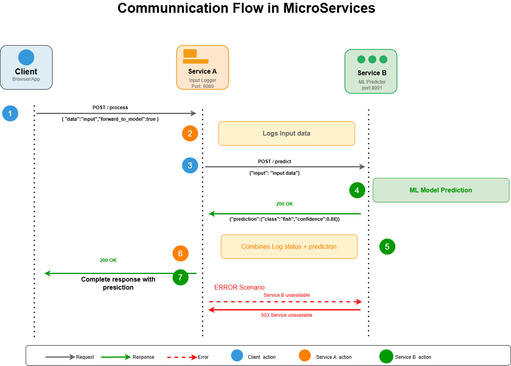
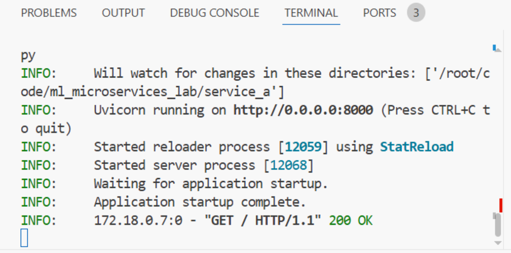
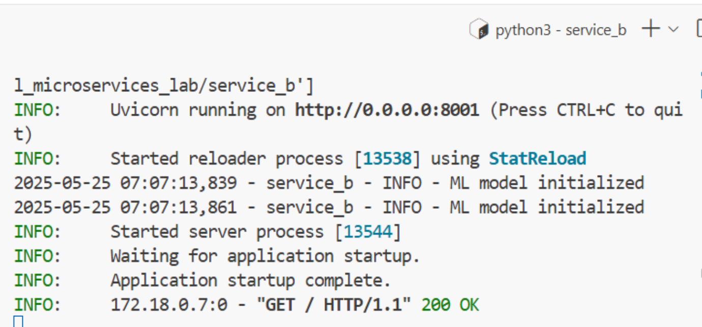
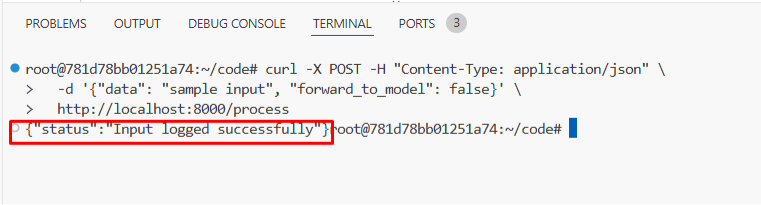
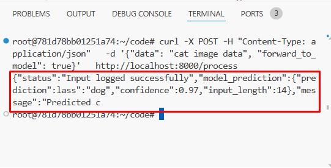
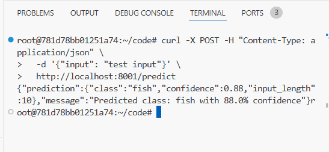

# Building Two Simple Microservices - Implementation Lab

## Lab Overview

This hands-on lab walks you through creating a **real-world microservices architecture** for machine learning applications. You'll build two independent services that communicate with each other to process data and make predictions.

### Learning Objectives

This comprehensive lab will take you through the complete journey of building microservices from the ground up. You'll start by understanding how to decompose monolithic applications into independent, loosely-coupled services that can be developed, deployed, and scaled separately. Through hands-on implementation, you'll master inter-service communication patterns using REST APIs, learning how services discover and interact with each other in a distributed environment. The lab emphasizes practical implementation of separation of concerns, where you'll see how different services handle specific responsibilities - one focusing on data logging and orchestration, while another specializes in machine learning predictions. You'll gain valuable experience in error handling and graceful service degradation, understanding how to build resilient systems that continue operating even when dependent services become unavailable. Throughout the process, you'll be immersed in distributed system design principles, learning about service boundaries, data consistency, and the trade-offs involved in microservices architecture. Finally, you'll validate your implementation using real HTTP clients, testing various scenarios including success paths, error conditions, and service interactions, giving you confidence in building production-ready microservices for machine learning applications.

### Architecture Components

- **Service A (Input Logger)**: Acts as the API gateway that receives client requests, logs all incoming data, and intelligently routes requests to the ML service when needed
- **Service B (ML Predictor)**: A dedicated machine learning service that processes prediction requests and returns classified results with confidence scores

## Prerequisites

- Python 3.8+ installed
- Basic understanding of REST APIs and HTTP methods
- Familiarity with JSON data format
- Terminal/command line experience
- Text editor or IDE (VS Code recommended)

---

## Step 1: Project Setup

### 1.1 Create Project tructure

```bash

ml_microservices_lab/
├── service_a/
│   ├── main.py
│   └── requirements.txt
├── service_b/
│   ├── main.py
│   └── requirements.txt
└── README.md

```

Create the main directory:

```bash
mkdir ml_microservices_lab
cd ml_microservices_lab
mkdir service_a service_b
```

---
## Understanding the Communication Flow



###  What Happens Step by Step

1. **Client sends request to Service A**
    - POST to `http://localhost:8000/process`
    - Includes data and forward_to_model flag
2. **Service A processes the request**
    - Logs the incoming data
    - Checks the `forward_to_model` flag
3. **If forwarding is enabled**
    - Service A makes HTTP request to Service B
    - Service B processes the prediction request
    - Service B returns prediction result
    - Service A combines its status with Service B's response
4. **Service A returns final response**
    - Either just the logging status
    - Or combined status + prediction result

## Step 2: Implement Service A (Input Logger)

### 2.1 Create Requirements File

Create `service_a/requirements.txt`:

```
fastapi==0.103.1
uvicorn==0.23.2
requests==2.31.0
pydantic==2.4.2
```

### 2.2 Implement Service A

Create `service_a/main.py`:

```python
from fastapi import FastAPI, HTTPException
from pydantic import BaseModel
import requests
import logging
import uvicorn

# Configure logging
logging.basicConfig(
    level=logging.INFO,
    format='%(asctime)s - %(name)s - %(levelname)s - %(message)s',
    handlers=[logging.StreamHandler()]
)
logger = logging.getLogger("service_a")

app = FastAPI(title="Service A - Input Logger")

# Define input data model
class InputData(BaseModel):
    data: str
    forward_to_model: bool = True

# Service B URL
SERVICE_B_URL = "http://localhost:8001/predict"

@app.get("/")
def read_root():
    return {"service": "Service A - Input Logger", "status": "running"}

@app.post("/process")
async def process_input(input_data: InputData):
# Log the received input
    logger.info(f"Received input: {input_data.data}")

# If forward_to_model is True, send the data to Service B
    if input_data.forward_to_model:
        try:
            response = requests.post(
                SERVICE_B_URL,
                json={"input": input_data.data}
            )
# Return both the logged status and the prediction from Service B
            return {
                "status": "Input logged successfully",
                "model_prediction": response.json()
            }
        except requests.RequestException as e:
            logger.error(f"Failed to reach Service B: {e}")
            raise HTTPException(
                status_code=503,
                detail=f"Service B is unavailable: {str(e)}"
            )
    else:
# Just return the logged status
        return {"status": "Input logged successfully"}

@app.get("/health")
def health_check():
    return {"service": "Service A", "status": "healthy"}

if __name__ == "__main__":
    uvicorn.run("main:app", host="0.0.0.0", port=8000, reload=True)

```

---

## Step 3: Implement Service B (ML Prediction Service)

### 3.1 Create Requirements File

Create `service_b/requirements.txt`:

```
fastapi==0.103.1
uvicorn==0.23.2
pydantic==2.4.2
```

### 3.2 Implement Service B

Create `service_b/main.py`:

```python
from fastapi import FastAPI
from pydantic import BaseModel
import logging
import uvicorn
import random

# Configure logging
logging.basicConfig(
    level=logging.INFO,
    format='%(asctime)s - %(name)s - %(levelname)s - %(message)s',
    handlers=[logging.StreamHandler()]
)
logger = logging.getLogger("service_b")

app = FastAPI(title="Service B - ML Prediction")

# Define input data model
class PredictionRequest(BaseModel):
    input: str

# Define a simple "model" (in reality, this would load a trained ML model)
class SimpleMlModel:
    def __init__(self):
        self.classes = ["cat", "dog", "bird", "fish", "rabbit"]
        logger.info("ML model initialized")

    def predict(self, input_text):
# For demonstration, we'll return a fixed prediction with confidence# In a real scenario, this would use the input to make an actual prediction
        logger.info(f"Making prediction for input: {input_text}")

# Simulate some processing time and randomness
        predicted_class = random.choice(self.classes)
        confidence = round(random.uniform(0.7, 0.99), 2)

        return {
            "class": predicted_class,
            "confidence": confidence,
            "input_length": len(input_text)
        }

# Initialize our "model"
model = SimpleMlModel()

@app.get("/")
def read_root():
    return {"service": "Service B - ML Prediction", "status": "running"}

@app.post("/predict")
async def predict(request: PredictionRequest):
# Log the received request
    logger.info(f"Received prediction request with input: {request.input}")

# Get prediction from model
    prediction = model.predict(request.input)

# Return the prediction
    return {
        "prediction": prediction,
        "message": f"Predicted class: {prediction['class']} with {prediction['confidence']*100:.1f}% confidence"
    }

@app.get("/health")
def health_check():
    return {"service": "Service B", "status": "healthy"}

if __name__ == "__main__":
    uvicorn.run("main:app", host="0.0.0.0", port=8001, reload=True)

```

---

## Step 4: Running the Services

### 4.1 Install Dependencies and Start Service A

Open Terminal 1:

```bash
cd service_a
pip install -r requirements.txt
python main.py

```

You should see output like:



### 4.2 Install Dependencies and Start Service B

Open Terminal 2:

```bash
cd service_b
pip install -r requirements.txt
python main.py
```

You should see output like:



---

## Step 5: Testing the Services

### 5.1 Test Using curl Commands

**Test Service A directly (without forwarding):**

```bash

curl -X POST -H "Content-Type: application/json" \
  -d '{"data": "sample input", "forward_to_model": false}' \
  http://localhost:8000/process

```

Expected result:



**Test Service A with forwarding to Service B:**

```bash
curl -X POST -H "Content-Type: application/json" \
  -d '{"data": "cat image data", "forward_to_model": true}' \
  http://localhost:8000/process

```

Expected response:



**Test Service B directly:**

```bash
curl -X POST -H "Content-Type: application/json" \
  -d '{"input": "test input"}' \
  http://localhost:8001/predict

```

Expected response:



**Test health endpoints:**

```bash

curl http://localhost:8000/health
curl http://localhost:8001/health

```


### Challenges in ML Microservices

1. **Service Discovery**
    - **Problem**: How services find and communicate with each other
    - **Current Solution**: Hardcoded URLs
    - **Better Solution**: Service registry (Consul, etcd) or DNS-based discovery
2. **Error Handling**
    - **Problem**: What happens when Service B is down?
    - **Current Solution**: HTTP exception with error message
    - **Better Solution**: Circuit breaker pattern, retry logic, fallback responses
3. **Data Consistency**
    - **Problem**: Ensuring consistent data across services
    - **Current Solution**: Direct HTTP calls
    - **Better Solution**: Event sourcing, message queues, eventual consistency

we've successfully built two microservices that work together - a logging service and an ML prediction service. we learned how services communicate using REST APIs, handle errors gracefully, and maintain independence while working as a system.
Through testing with curl, we verified that our services can handle normal requests, forward data between each other, and respond properly when things go wrong. These are the same patterns used in real production systems.
 now,we understand the basics of microservices architecture and are ready to explore more advanced topics like Docker containers, databases, and cloud deployment.